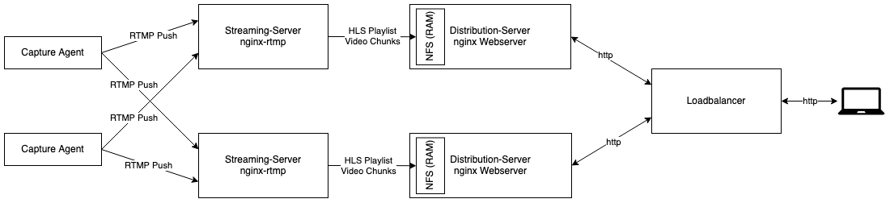

Live Streaming at the University of Bern
========================================

## Architecture

This image shows a redundant live streaming setup. However, the set-up can also be reduced to a single streaming and distribution server.

## Configuration

### Extron SMP

The live streaming method selected is RTMP push. For each recording, the Extron SMP starts an RTMP live stream that is pushed to the nginx-rtmp streaming server. The Extron SMP can't distinguish between Opencast live streaming events and recordings only.

### nginx-rtmp

We use the ["NGINX-based Media Streaming Server" (nginx-rtmp-module)](https://github.com/arut/nginx-rtmp-module).

Nginx-rtmp needs an RTMP live stream as input. For each live stream nginx-rtmp creates a subdirectory named by the rtmp stream name. The video *.ts and playlist files are created in this subdirectory.
Have a look at the [nginx-rtmp config file](nginx-rtmp-livestreaming.conf)

### Opencast

Follow the [Opencast live schedule documentation](https://docs.opencast.org/r/13.x/admin/#modules/liveschedule/) to configure Opencast for live streaming.
Main configuration is done in the [org.opencastproject.liveschedule.impl.LiveScheduleServiceImpl.cfg](org.opencastproject.liveschedule.impl.LiveScheduleServiceImpl.cfg) config file and the [schedule-and-upload.xml](schedule-and-upload.xml) workflow.
